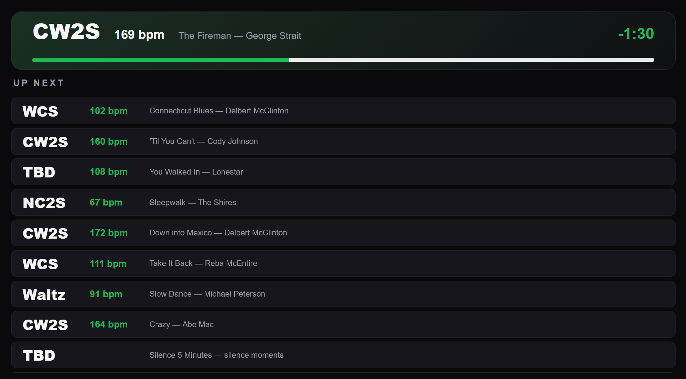

# soloist-go

A web server implemented in GoLang that displays the currently-playing Spotify track, followed by a list of the next 10 upcoming tracks.

The list is updated in real-time.

The web server runs on a headless Raspberry Pi.


## References

- https://developer.spotify.com/documentation/soloist
- https://developer.spotify.com/blog/2026-08-13-introducing-spotify-soloist
- https://community.spotify.com/t5/Spotify-for-Developers/Spotify-Soloist-a-new-terminal-based-player-for-headless-and-DIY/td-p/7529090


## Spotify Soloist API Key

The Soloist API Key is generated from the Spotify Developer dashboard. It should be specified in the `.env` file located in the project root directory as the variable, SOLOIST_API_KEY (not to be committed into the Git repository).


## Setup

```
# Update the system
sudo apt update
sudo apt full-upgrade -y
sudo apt autoremove
sudo reboot

# Install additional packages
sudo apt install git
sudo apt install jq
sudo apt install sqlite3
sudo apt install libsqlite3-dev

# Install Golang
cd /tmp
wget https://go.dev/dl/go1.27.1.linux-arm64.tar.gz
sudo tar -C /usr/local -xzf go1.27.1.linux-arm64.tar.gz
rm go1.27.1.linux-arm64.tar.gz
echo 'export PATH=$PATH:/usr/local/go/bin' >> ~/.bashrc
. ~/.bashrc
go version

# Install soloist
cd
mkdir soloist
cd soloist
wget https://soloist-builds.spotifycdn.com/soloist_release_arm64.tar.gz
tar -xzf soloist_release_arm64.tar.gz 
test -x soloist
sudo install -m 755 soloist /usr/local/bin/soloist
soloist --version
soloist --help

# Clone soloist-go Git repo
cd
git clone https://github.com/belltown/soloist-go.git

# Install the SQLite3 database into ~/spotify-db/spotify/sqlite3.db

# Change into soloist-go directory and set up .env file, adding Soloist API key, etc.
cd ~/soloist-go
cp .env .env.example
# Edit .env
```


## Start Soloist

```sh
./start_soloist.sh
```


## GoLang Minimal Soloist Server and Web Application Proof-of-Concept

A small Go program bridges the local Soloist WebSocket API to any number of
browser clients on the network.

- `soloist-go` connects to the Soloist WebSocket API at `ws://127.0.0.1:${SOLOIST_PORT}`, handles the `auth_state` event sent on connect, and issues a `get_queue` command (limit 10) once logged in.

- It listens for `playback_state`, `track_changed`, and `queue_changed` events to keep the currently-playing track name and the next 10 queued track names up to date.

- It runs an HTTP/WebSocket server on `0.0.0.0:${WEB_PORT}`, publicly accessible on the local network. Each browser that connects gets its own WebSocket at `/ws` and receives the latest state immediately, followed by real-time pushes whenever the track or queue changes.

- A minimal proof-of-concept web page (served at `/`) opens that WebSocket and renders the currently-playing track name and the upcoming queue.

### Project layout

```
main.go                    HTTP/WebSocket server entry point (flags: --soloist-ws, --listen, --env-file, --db-path)
internal/soloist/client.go Soloist WebSocket client: auth_state, get_queue, track/queue events
internal/metadata/metadata.go Looks up track metadata from the SQLite3 database by spotify_id
internal/dotenv/dotenv.go  Minimal .env loader (doesn't override already-set env vars)
internal/hub/hub.go        Broadcasts playback state to connected browser clients
web/index.html             Proof-of-concept web page (embedded into the binary)
```

### Build and run

```sh
go build -o soloist-go .
./soloist-go
```

Start `./start_soloist.sh` first so the Soloist WebSocket API at `127.0.0.1:${SOLOIST_PORT}` is available, then open `http://<raspberry-pi-address>:${WEB_PORT}/` from any device on the network. The values come from `.env`; `--soloist-ws` and `--listen` can still override them.


## Implement Database Access for Track Metadata

The server looks up track metadata from the SQLite3 database at `DB_PATH` (from `.env`) for the currently-playing track and each track in the queue.

- `internal/metadata/metadata.go` opens the database with the pure-Go `modernc.org/sqlite` driver and queries `spotify_track_metadata` by `spotify_id` (backed by the unique index `idx_spotify_id_unique`). The `spotify_id` is derived from the Soloist `uri` (`entity_type = "track"`) by stripping the `spotify:track:` prefix.

- For each track, it retrieves `spotify_id`, `track_name`, `artist_name`, `duration`, `dance`, `tempo`, and `override_tempo`, falling back to the Soloist-reported name when a track isn't found in the database (or isn't a Spotify track).

- `internal/dotenv/dotenv.go` loads `.env` (found next to the running executable, or via `--env-file`) so `DB_PATH` doesn't need to be exported into the shell before running the server; use `--db-path` to override it.

- The web page displays each track's name, artist, duration, tempo, and dance style alongside the real-time now-playing/queue updates.

Here are the relevant portions of the SQLite3 database schema:

```
user@pisp:~/soloist-go $ sqlite3 $DB_PATH
SQLite version 3.46.1 2024-08-13 09:16:08
Enter ".help" for usage hints.
sqlite> .fullschema
CREATE TABLE spotify_track_metadata (
  the_key INTEGER PRIMARY KEY AUTOINCREMENT,
  initial_timestamp INTEGER DEFAULT NULL,
  initial_playlist TEXT DEFAULT NULL,
  duration INTEGER NOT NULL,
  dance TEXT DEFAULT NULL,
  track_name TEXT NOT NULL,
  artist_name TEXT NOT NULL,
  album_name TEXT NOT NULL,
  tempo INTEGER NOT NULL,
  override_tempo INTEGER NOT NULL,
  fade_in INTEGER NOT NULL,
  fade_out INTEGER NOT NULL,
  genre TEXT NOT NULL,
  spotify_id TEXT NOT NULL,
  volume INTEGER NOT NULL,
  playcount INTEGER NOT NULL,
  last_played TEXT NOT NULL,
  timesig INTEGER NOT NULL,
  danceability REAL NOT NULL,
  energy REAL NOT NULL,
  release_date TEXT NOT NULL,
  popularity INTEGER NOT NULL,
  explicit INTEGER NOT NULL,
  spotify_url TEXT NOT NULL,
  preview_url TEXT NOT NULL
, isrc TEXT DEFAULT NULL);

...
...
...

CREATE UNIQUE INDEX idx_spotify_id_unique ON spotify_track_metadata(spotify_id);

...
...
...
```

`DB_PATH` (and `SOLOIST_API_KEY`) must be set in `.env` for `soloist-go` to start; run [build_db.sh](build_db.sh) first if the database doesn't exist yet.


## Demo


